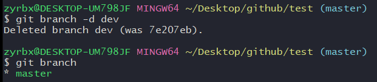

# 基本

## 什么是分支

分支是为了将修改记录的整体流程分叉保存。分叉后的分支不受其他分支的影响，所以在同一个数据库里可以同时进行多个修改。


## 创建与合并分支分析

每次提交，Git都把他们串成一条时间线，这条时间线是一个分支，在前八节的demo中，只有一条时间线，在Git里叫这个分支为主分支（master分支）。HEAD严格来说不是指向提交，而是指向master分支，master才是指向提交的，所以HEAD就是指向当前分支。一开始的时候，master分支是一条线，Git用master指向最新的提交，再用HEAD指向master。 

1. 当我们创建新的分支（例如dev分支）时，Git创建了一个指针叫dev，指向master相同的提交，再把HEAD指向dev，就表示当前分支在dev上：  从上图可看出，Git创建个分支很快，因为除了增加一个dev指针，修改下HEAD指向，工作区的文件都没有任何变化。 从现在开始我们提交文件就是在dev分支上进行操作了，比如提交一次后，dev指针往前一步，master指针不变。  假如我们工作完成了，要把dev分支上的内容合并master分支上，最直接的方法是把master指向dev的当前提交，如下图  所以Git合并也特别快，就改改指针，工作区不变！！！ 合并完分支后，可以删除dev分支，只剩下master，如图 

## 分支演示

### 创建

**创建分支；**

```bash
git branch 分支名称 # 新建一个分支。
```

**切换分支；**

```bash
git checkout 分支名称 # 切换到指定分支。
```

**创建并切换到新分支；**

```bash
git checkout -b 分支名称
```

从master分支切换到test分支。


**查看当前所在分支;**

```bash
git branch # 包含所有分支
```


1. 从dev分支创建一个dev.txt文件。并commit。

   从 dev分支创建文件。如果不合并到主分支，主分支不会看到此文件。

   

2. 切换会master分支，会发现从dev分支创建的文件提交的内容不见了。

   

3. 要想从master看到其它分支内容，就需要合并分支。

### 合并

```bash
git merge 分支名称 # 将某分支合并到当前分支。
```

- 使用分支合并命令，就可以轻松合并到主分支上了。
- 注意到上面的Fast-forward信息，Git告诉我们，这次合并是“快进模式”，也就是把master指向dev的当前提交，所以合并速度很快，无需动工作区内容。


**删除已经合并的分支；**

```bash
git branch -d 分支名称 # 删除指定的分支。
```




