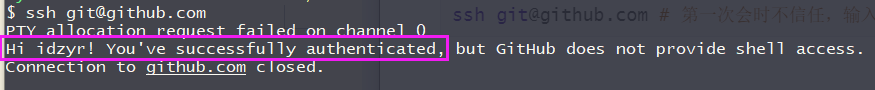

# SSH

## 为什么要配置SSH

通过SSH我们可以更方便操作远程库，在每次提交代码是无需重复验证身份。

## 生成公钥

1. 打开git bash here

   ```bash
   ssh-keygen -t rsa -C "你的邮箱" # 
   ```

   **参数；**

   - `-t` 加密类型，采用`rsa`加密方式,

   - `-C` 备注，一般是设置为个人账户的邮箱也就是之前我们配置的邮箱。

2. 系统会询问你文件名和秘钥密码，可以一路回车过去，不指定文件名称和密码。

3. 会在以下目录`C:\Users\当前用户\.ssh`会有两个已id开头的文件分别是公钥和私钥。

   - id_rsa 私钥
   - id_rsa.pub 公钥

> 更多SSH使用
>
> https://www.jianshu.com/p/dd053c18e5ee

## 添加公钥到服务器

这里以GitHub为例子。

1. 在``C:\Users\当前用户\.ssh`目录打开`id_rsa.pub` 公钥将内容全部复制。

2. 打开GitHub中的设置ssh密钥粘贴刚才复制的公钥内容。

   https://github.com/settings/keys

3. 验证密钥是否设置成功

   ```bash
   ssh git@github.com # 第一次会时不信任，输入yes信任即可。
   ```

4. 

5. 取消ssh操作，可以到对应平台的ssh设置选项删除ssh密钥即可。

   

> [!TIP] 
>
> 如果是验证其它平台把git@github.com 中的@后面中的域名替换成其它平台即可。


