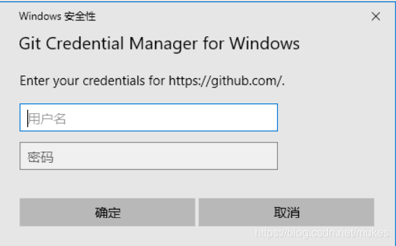
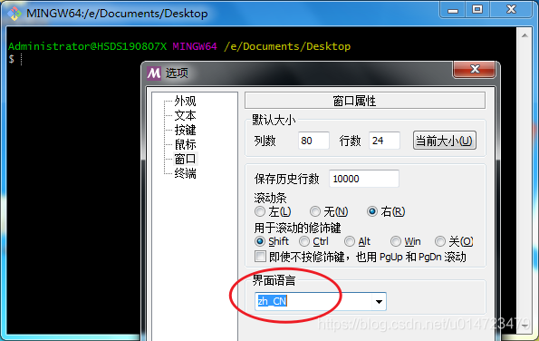

# Windows

## 下载

git官网

https://git-scm.com/

下载地址；

https://git-scm.com/download/win


## 安装

我下载的版本是 Git-2.31.1-64-bit.exe，接下来我们就对这个版本进行安装工作。

### 使用许可声明

双击下载后的 Git-2.31.1-64-bit.exe，开始安装，这个界面主要展示了 GPL 第 2 版协议1的内容，点击 [next] 到第二步。


### 选择安装目录

可点击 “Browse…” 更换目录，也可直接在方框里面改，我一般直接将 “C” 改为 “D”，这样就直接安装在 D 盘里了。点击 [next] 到第三步。


### 选择安装组件

图中这些英文都比较简单，我已经把大概意思翻译出来了，大家根据自己的需要选择勾选。点击 [next] 到第四步。


更多关于 TrueType font 的介绍：

>百度百科 - TrueType 字体 [https://baike.baidu.com/item/TrueType%E5%AD%97%E4%BD%93/6042683?fr=aladdin]
>
>维基百科 - TrueType [https://en.wikipedia.org/wiki/TrueType]

### 选择开始菜单文件夹

方框内 Git 可改为其他名字，也可点击 “Browse…” 选择其他文件夹。


安装成功后在开始菜单里的图如下：


但不能不要文件夹，把文件夹名删了点击下一步会出现错误。修正后点击 [next] 到第五步。


### 选择 Git 默认编辑器

Git 安装程序里面内置了 10 种编辑器供你挑选，比如 Atom、Notepad、Notepad++、Sublime Text、Visual Studio Code、Vim 等等，默认的是 Vim ，选择 Vim 后可以直接进行到下一步，但是 Vim 是纯命令行，操作有点难度，需要学习。如果选其他编辑器，则还需要去其官网安装后才能进行下一步。

下图为默认编辑器 Vim.可直接点击 [next] 到第六步。


如果你不想用 Vim 当默认编辑器，换一个，比如 Notepad++ ，那么你者需要点击下面的蓝色字体 " Notepad++ " 去其官网下载安装好才能进行下一步 [next].


安装后还要配置在我的电脑->属性->高级系统设置->高级->环境变量->系统变量->Path->编辑添加 Notepad++ 的安装地址，如 C:\Program Files\notepad++.
这样才能在 Git Bash 里面直接调用 Notepad++.

```
$ notepad++ 文件名.后缀  //在 git bash 调用 notepad++ 打开文件
```

新手建议使用 Notepad++ 、Sublime Text，这两个和 Windows 自带的记事本差不多，不过功能相差很大。点击 [next] 到第六步。

### 决定初始化新项目(仓库)的主干名字

第一种是让 Git 自己选择，名字是 master ，但是未来也有可能会改为其他名字；第二种是我们自行决定，默认是 main，当然，你也可以改为其他的名字。一般默认第一种，点击 [next] 到第七步。


> **注：**
>
>  第二个选项下面有个 NEW！ ，说很多团队已经重命名他们的默认主干名为 main . 这是因为2020 年非裔男子乔治·弗洛伊德因白人警察暴力执法惨死而掀起的 Black Lives Matter(黑人的命也是命)运动，很多人认为 master 不尊重黑人，呼吁改为 main.

### 调整你的 path 环境变量


翻译如下：

```
Use Git from Git Bash only 
This is the most cautious choice as your PATH will not be modified at all. You w only be able to use the Git command line tools from Git Bash.
仅从 Git Bash 使用 Git
这是最谨慎的选择，因为您的 PATH 根本不会被修改。您将只能使用 Git Bash 中的 Git 命令行工具。


Git from the command line and also from 3rd-party software
(Recommended) This option adds only some minimal Git wrappers to your PATH to avoid cluttering your environment with optional Unix tools.
You will be able to use Git from Git Bash, the Command Prompt and the Windov PowerShell as well as any third-party software looking for Git in PATH.
从命令行以及第三方软件进行 Git
（推荐）此选项仅将一些最小的 Git 包装器添加到PATH中，以避免使用可选的 Unix 工具使环境混乱。
您将能够使用 Git Bash 中的 Git，命令提示符和 Windov PowerShell 以及在 PATH 中寻找 Git 的任何第三方软件。


Use Git and optional Unix tools from the Command Prompt 
Both Git and the optional Unix tools will be added to your PATH.
Warning: This will override Windows tools like "find"and "sort". Only use this option if you understand the implications.
使用命令提示符中的 Git 和可选的 Unix 工具
Git 和可选的 Unix 工具都将添加到您的 PATH 中。
警告：这将覆盖 Windows 工具，例如 "find" and "sort". 仅在了解其含义后使用此选项。


```


第一种是仅从 Git Bash 使用 Git。这个的意思就是你只能通过 Git 安装后的 Git Bash 来使用 Git ，其他的什么命令提示符啊等第三方软件都不行。

第二种是从命令行以及第三方软件进行 Git。这个就是在第一种基础上进行第三方支持，你将能够从 Git Bash，命令提示符(cmd) 和 Windows PowerShell 以及可以从 Windows 系统环境变量中寻找 Git 的任何第三方软件中使用 Git。推荐使用这个。

第三种是从命令提示符使用 Git 和可选的 Unix 工具。选择这种将覆盖 Windows 工具，如 “ find 和 sort ”。只有在了解其含义后才使用此选项。一句话，适合比较懂的人折腾。

### 选择HTTPS后端传输


翻译如下：

```
use the OpenSSL library 
Server certificates will be validated using the ca-bundle. crt file.
使用 OpenSSL 库
服务器证书将使用 ca-bundle.crt 文件进行验证。
	
Use the native Windows Secure Channel library 
Server certificates will be validated using Windows Certificate Stores.
This option also allows you to use your company's internal Root CA certificates distributed e.g. via Active Directory Domain Services.
使用本机 Windows 安全通道库
服务器证书将使用 Windows 证书存储进行验证。
此选项还允许您使用公司内部分发的内部根 CA 证书，例如通过 Active Directory 域服务。


```


这两种选项有什么区别呢？

> 来自https://stackoverflow.com/questions/62456484/whats-the-difference-between-openssl-and-the-native-windows-secure-channel-libr

如果在具有企业管理证书的组织中使用 Git，则将需要使用安全通道。如果你仅使用 Git 来访问公共存储库（例如 GitHub ），或者你的组织不管理自己的证书，那么使用 SSL 后端（它们只是同一协议的不同实现）就可以了。

也就是说，作为普通用户，只是用 Git 来访问 Github、GitLab 等网站，选择前者就行了。点击 [next] 到第九步。

### 配置行尾符号转换


```
Checkout Windows-style, commit Unix-style line endings 
Git will convert LF to CRLF when checking out text files. 
When committing text files, CRLF will be converted to LF. For cross-platform projects, this is the recommended setting on Windows("core. autocrif"is set to "true").
签出 Windows 样式，提交 Unix 样式的行结尾
Git 签出文本文件时，会将 LF 转换为 CRLF。
提交文本文件时，CRLF 将转换为 LF。
对于跨平台项目，这是 Windows 上的建议设置（"core.autocrif" 设置为 "true"）。

Checkout as-is, commit Unix-style line endings 
Git will not perform any conversion when checking out text files. 
When committing text files, CRLF will be converted to LF. For cross-platform projects, this is the recommended setting on Unix("core.autocrif" is set to "input").
按原样签出，提交 Unix 样式的行结尾
Git 在签出文本文件时不会执行任何转换。提交文本文件时，CRLF 将转换为 LF。
对于跨平台项目，这是在 Unix 上的建议设置（"core.autocrif" 设置为 "input"）。

Checkout as-is, commit as-is 
Git will not perform any conversions when checking out or committing text files. 
Choosing this option is not recommended for cross-platform projects("core. autocrif"is set to "false").
按原样签出，按原样提交
Git 在签出或提交文本文件时不会执行任何转换。
不建议跨平台项目选择此选项（"core.autocrif" 设置为 "false"）。

```


这三种选择分别是：
签出 Windows 样式，提交 Unix 样式的行结尾。
按原样签出，提交Unix样式的行结尾。
按原样签出，按原样提交。


那 Windows 样式和 Unix 样式到底有什么区别呢？

引用 《GitHub 入门与实践》 第 50 页内容

> GitHub 中公开的代码大部分都是以 Mac 或 Linux 中的 LF（Line Feed）换行。然而，由于 Windows 中是以 CRLF（Carriage Return+ Line Feed）换行的，所以在非对应的编辑器中将不能正常显示。
>
> Git 可以通过设置自动转换这些换行符。使用 Windows 环境的各位，请选择推荐的 “Checkout Windows-style，commit Unix-style line endings” 选项。换行符在签出时会自动转换为 CRLF，在提交时则会自动转换为 LF .


上面说 Mac 、Linux、Unix 的 Line Feed ，翻译过来就是换行符，用 “\n” 表示，换行符 “\n” 的 ASCII 值为10；
Windows 的是 Carriage Return+ Line Feed（回车+换行），用 “\r\n” 表示，回车符 “\r” 的 ASCII 值为13；

这上下两者是不一样的。
所以这就需要转换了，至于为什么选第一项？
这还用问吗？我们现在的教程就是介绍怎么安装 Windows 版 Git，肯定选第一项啦。

至于 “回车”（carriage return）和 “换行”（line feed）这两个概念的来历和区别？
引用一下 阮一峰老师博客的部分内容

> 在计算机还没有出现之前，有一种叫做电传打字机（Teletype Model 33）的玩意，每秒钟可以打 10 个字符。但是它有一个问题，就是打字机打完一行换行的时候，要用去 0.2 秒，正好可以打两个字符。要是在这 0.2 秒里面，又有新的字符传过来，那么这个字符将丢失。
> 于是，研制人员想了个办法解决这个问题，就是在每行后面加两个表示结束的字符。一个叫做 "回车"，告诉打字机把打印头定位在左边界；另一个叫做 "换行"，告诉打字机把纸向下移一行。

更多资料参考：

1. 腾讯云 - 换行符 ‘\n’ 和 回车符 ‘\r’ 的区别？[https://cloud.tencent.com/developer/article/1353286]
2. 知乎 - 为什么会用 \r\n 两个字符表示换行？[https://www.zhihu.com/question/29326647]
3. Stackoverflow - What are carriage return, linefeed, and form feed?[https://stackoverflow.com/questions/3091524/what-are-carriage-return-linefeed-and-form-feed]

点击 [next] 到第十步。

### 配置终端模拟器以与 Git Bash 一起使用


```
Use MinTTY(the default terminal of MSYS2) 
Git Bash will use MinTTY as terminal emulator, which sports a resizable window
non-rectangular selections and a Unicode font.Windows console programs(such
as interactive Python) must be launched via 'winpty' to work in MinTTY.
使用 MinTTY（MSYS2的默认终端）
Git Bash 将使用 MinTTY 作为终端仿真器，该仿真器具有可调整大小的窗口非矩形选择和 Unicode 字体。
Windows 控制台程序（例如交互式 Python）必须通过 "winpty" 启动才能在 MinTTY 中运行。

Use Windows' default console 
window Git will use the default console window of Windows("cmd.exe"), which works v
with Win32 console programs such as interactive Python or node. js, but has a
very limited default scroll-back,needs to be configured to use a Unicode font in 
order to display non-ASCII characters correctly, and prior to Windows 10 its 
window was not freely resizable and it only allowed rectangular text selections.<br>
使用 Windows 的默认控制台窗口
Git 将使用 Windows 的默认控制台窗口（"cmd.exe"），该窗口可与 Win32 控制台程序（例如交互式Python 或 
node.js）一起使用，但默认回滚非常有限，需要将其配置为使用 Unicode 字体才能正确显示非 ASCII 字符，并且在 
Windows 10 之前，其窗口不可随意调整大小，并且仅允许选择矩形文本。


```


建议选择第一种，MinTTY 功能比 cmd 多，cmd 只不过 比 MinTTY 更适合处理 Windows 的一些接口问题，这个对 Git 用处不大，除此之外 Windows 的默认控制台窗口（'cmd’）有很多劣势，比如 cmd 具有非常有限的默认历史记录回滚堆栈和糟糕的字体编码等等。
相比之下，MinTTY 具有可调整大小的窗口和其他有用的可配置选项，可以通过右键单击的工具栏来打开它们 git-bash 。点击 [next] 到第十一步。

### 选择默认的 “git pull” 行为


```
ODefault(fast-forward or merge)
This is the standard behavior ofgit pull": fast-forward the current branch to 
the fetched branch when possible, otherwise create a merge commit.
默认（快进或合并）
这是 "git pull" 的标准行为：在可能的情况下将 当前分支 快进到 获取的分支，否则创建合并提交。

ORebase Rebase the current branch onto the fetched branch. If there are no local 
commits to rebase, this is equivalent to a fast-forward.
变基将当前分支变基到获取的分支上。如果没有本地提交要变基，则等同于快进。

Oonly ever fast-forward 
Fast-forward to the fetched branch. Fail if that is not possible.
只能快进快进到获取的分支。如果不可能，则失败。

```


“git pull” 是什么意思呢？
git pull 就是获取最新的远程仓库分支到本地，并与本地分支合并

上面给了三个 “git pull” 的行为：
第一个是 `merge`

```bash
git pull = git fetch + git merge
```


第二个是 `rebase`

```bash
git pull = git fetch + git rebase
```


第三个是 直接获取

````bash
git pull = git fetch ？(这个没试过，纯属猜测
````


一般默认选择第一项，git rebase 绝大部分程序员都用不好或者不懂，而且风险很大，但是很多会用的人也很推崇，但是用不好就是灾难。

git pull 只是拉取远程分支并与本地分支合并，而 git fetch 只是拉取远程分支，怎么合并，选择 merge 还是 rebase ，可以再做选择。

更多参考资料：

1. 知乎 - git pull 和 git fetch 的区别？ [https://www.zhihu.com/question/38305012]
2. 知乎 - 在开发过程中使用 git rebase 还是 git merge，优缺点分别是什么？ [https://www.zhihu.com/question/36509119]
3. Stackoverflow - Why does git perform fast-forward merges by default? [https://stackoverflow.com/questions/2850369]
4. Stackoverflow - In git how is fetch different than pull and how is merge different than rebase? [https://stackoverflow.com/questions/14894768/]
5. Stackoverflow - Difference between git pull and git pull --rebase [https://stackoverflow.com/questions/18930527]


### 选择一个凭证帮助程序


```
Git Credential Manager Core
(NEW) Use the new, cross-platform version of the Git Credential Manager.
See more information about the future of Git Credential Manager here.
Git凭证管理核心
( NEW! ) 使用新的跨平台版本的 Git Credential Manager。
在此处查看有关 Git Credential Manager 未来的更多信息。


Git Credential Manager
(DEPRECATED) The Git Credential Manager for Windows handles credentials e.g.
for Azure DevOps and GitHub(requires. NET framework v4.5.1 or later).
Git 凭证管理
(不推荐) Windows 的 Git 凭据管理器处理凭据，例如
适用于Azure DevOps 和 GitHub（需要.NET Framework v4.5.1 或更高版本）。

None Do not use a credential helper.
不使用凭证助手。

```


一共三个选项：
Git 凭证管理核心
Git 凭证管理
不使用凭证助手

这前两个选项是提供登录凭证帮助的，Git 有时需要用户的凭据才能执行操作；例如，可能需要输入用户名和密码才能通过 HTTP 访问远程存储库（GitHub，GItLab 等等）。

第一个和第二个选项的区别？
Git 凭证管理核心 是 Git 凭证管理 的新版本。

引用https://github.com/microsoft/Git-Credential-Manager-Core/blob/master/docs/faq.md#about-the-project

> Windows 的 Git 凭据管理器（Git Credential Manager）是在 Windows 上运行的基于 .NET Framework 的 Git 凭据帮助器。同样，适用于 Mac 和 Linux 的 Git 凭据管理器（Java GCM）是基于 Java 的 Git 凭据帮助器，仅可在 macOS 和 Linux 上运行。尽管这两个项目都旨在解决相同的问题（使用 Git 提供无缝的多因素 HTTPS 身份验证），但它们基于不同的代码库和语言，因此难以确保特性对等。
> Git Credential Manager Core（GCM Core）旨在用统一的代码库替换 GCM Windows 和 Java GCM，这在将来应该更容易维护和增强。

登录图如下(属于第二个选项的，老图了)，来自https://segmentfault.com/q/1010000011171685




更多参考资料：

1. Stackoverflow - Is Control Panel’s Credential Manager same as git’s credential helpers Credential Manager and Credential manager Core? [https://stackoverflow.com/questions/66795897]
2. GitHub - Git Credential Manager Core [https://github.com/microsoft/Git-Credential-Manager-Core]
3. GitHub - Git Credential Manager Core Core FAQ [https://github.com/microsoft/Git-Credential-Manager-Core/blob/master/docs/faq.md#about-the-project]
4. Git 官网文档 - https://git-scm.com/docs/gitcredentials [https://git-scm.com/docs/gitcredentials]
   

点击 [next] 进到十三步。

### 配置额外的选项


```
Enable file system caching 
File system data will be read in bulk and cached in memory for certain operations("core.fscache" is set to "true"). 
This provides a significant performance boost.
启用文件系统缓存
将批量读取文件系统数据并将其缓存在内存中以进行某些操作（"core.fscache” 设置为 "true"）。
这可以显着提高性能。


Enable symbolic links 
Enable symbolic links(requires the SeCreateSymbolicLink permission).
Please note that existing repositories are unaffected by this setting.
启用符号链接
启用符号链接（需要SeCreateSymbolicLink权限）。
请注意，现有存储库不受此设置的影响。


```


有两个选项：
启用文件系统缓存
启用符号链接

启用文件系统缓存就是将批量读取文件系统数据并将其缓存在内存中以进行某些操作，可以显著提升性能。这个选项默认开启。
启用符号链接 ，符号链接是一类特殊的文件， 其包含有一条以绝对路径或者相对路径的形式指向其它文件或者目录的引用，类似于 Windows 的快捷方式，不完全等同 类Unix（如 Linux） 下的 符号链接。因为该功能的支持需要一些条件，所以默认不开启。


更多关于 “符号链接” 参考资料：

1. GitHub - Symbolic-Links [https://github.com/git-for-windows/git/wiki/Symbolic-Links]
2. Stackoverflow - How does Git handle symbolic links? [https://stackoverflow.com/questions/954560/]
3. Stackoverflow - What is the difference between NTFS Junction Points and Symbolic Links? [https://stackoverflow.com/questions/9042542/]
   

点击 [next] 到第十四步。

### 配置实验性选项


翻译如下：

```
Enable experimental support for pseudo consoles.
(NEW!) This allows running native console programs like Node or Python in a Git Bash window without using winpty, 
but it still has known bugs.
启用对伪控制台的实验性支持。
(新功能!) 这允许在不使用 winpty 的情况下在 Git Bash 窗口中运行诸如 Node 或 Python 之类的本机控制台程序，
但是它仍然存在已知的错误。
```


这是实验性功能，可能会有一些小错误之类的，建议不用开启。
点击 [install] 进行安装。

安装成功

## 功能介绍

这是安装成功后开始菜单里面的图。


有 Git Bash、Git CMD、Git FAQs、Git GUI、Git Release Note，下面我们就分别介绍一下这几个。

 **Git Bash;**
Git Bash 是基于CMD的，在CMD的基础上增添一些新的命令与功能，平时主要用这个，功能很丰富，长这样：


**Git CMD;**
Git CMD 不能说和 cmd 完全一样，只能说一模一样，功能少得可怜，两者如下图：


**Git FAQs;**
Git FAQs 就是 Git Frequently Asked Questions（常问问题），访问地址：https://github.com/git-for-windows/git/wiki/FAQ

**Git GUI;**
Git GUI 就是 Git 的图形化界面，如下图：

可以通过它快速创建新仓库（项目），克隆存在的仓库（项目），打开存在的仓库（仓库）。


**Git Release Note;**
Git Release Note 就是版本说明，增加了什么功能，修复了什么 bug 之类的。

## 汉化[可选]

### Git bash

Git bash的汉化很简单，只需要在命令行界面点击右键-选择option-Windows-然后在里面将language设置成中文就可以了。



### Git GUI

1. 下载汉化报 https://github.com/stayor/git-gui-zh
2. 下载下来之后，将其放到``git安装目录/mingw64/share/git-gui/lib/msgs/zh_cn.msg`，有可能Git的安装路径下面没有msgs这个文件夹，那么需要自己创建之后再将这个汉化包来放进去。这样就算是汉化完了。


## 引用

Git 详细安装教程（详解 Git 安装过程的每一个步骤）

https://blog.csdn.net/mukes/article/details/115693833

Git GUI如何汉化设置成中文？

https://blog.csdn.net/u014723479/article/details/102869727
