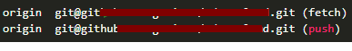
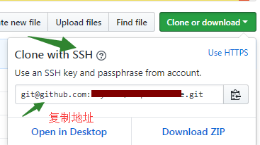
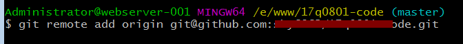
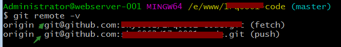

# 每次提交需要用户和密码

## 原因

在clone 项目的时候，使用了 https方式，而不是ssh方式。或本地仓库关联远程仓库时。

## 解决

删除当前的https关联方式修改为ssh即可。

到本地项目文件夹子，打开git bash 

1. 查看clone 地址：git remote -v

 

 说明是https 方式，现在换成ssh方式。

2. 移除https的方式，换成 ssh方式`git remote rm origin`
3. 添加新的git方式：ssh方式，ssh方式地址的话，在github上，切换到ssh方式，然后复制地址。

 `git remote add origin git地址` 关联SSH方式

 

4. 查看push方式是否修改成功：`git remote -v`

看到如下，说明成功，地址是以git开头

**参考教程；**

https://www.cnblogs.com/sky6862/p/7992736.html
