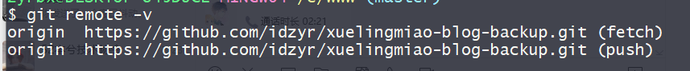

# 关联远程仓库

## 基本

```bash
git remote add 远程仓库名称 git@github.com:仓库ssh地址。 # 仓库地址可以到自己的在线GitHub项目查看。

# 举例
git remote add origin git@github.com:idzyr/test.git
# - origin 远程仓库名称。
```

查看是否关联成功。

```bash
git remote -v
```




删除与远程仓库的关联

```bash
git remote rm origin
```
