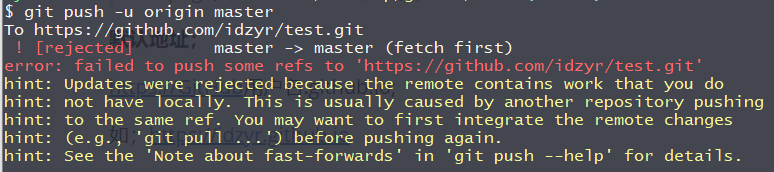

# 推&拉

## 推送到远程仓库

- 本地仓库提交的远程仓库。

  第一次执行会出现需要登录密码授权。

```bash
  git push -u origin master #第一次推送master分支到远程仓库需要添加-u 参数 origin 远程仓库名称

  git push origin master # 不是第一次提交使用。（仓库已经有master分支）
```

如果出现以下错误；我们需要把远程仓库文件拉到本地。在推送



## 拉取远程仓库文件

```bash
git pull origin master # 拉去远程仓库文件。origin远程仓库名称。
```
