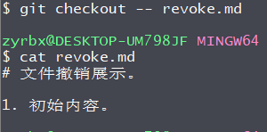

# 从暂存区

如果被恢复文件从暂存区就使用暂存区文件恢复到工作区，恢复文件都是最新一次更改。

文件修改后已经放到暂存区，那么执行命令`git checkout -- file`就会恢复到和**暂存区中**的文件一模一样的内容。

**暂存区恢复演示；**

1. 这里建立了一个revoke.md 文件做测试。

   ```markdown
   # 文件撤销展示。
   
   1. 初始内容。
   ```

1. 执行`git add revoke.md` 添加到暂存区。

   

2. 再次修改revoke.md 文件内容。

   ```markdown
   # 文件撤销展示。
   
   1. 初始内容。
   2. 我是添加到暂存区后，新加的内容。如果从暂存区还原我将会被删除。
   ```

1. 执行`git checkout -- revoke.md` 从暂存区恢复文件内容。可以看到文件又被还原到初始状态。

   
