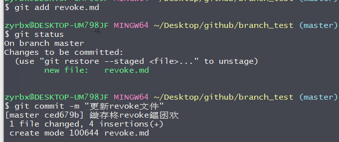
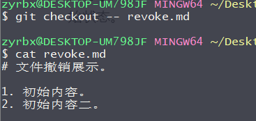

# 从版本库

如果被恢复文件从本地版本库（也就是commit后）就使用本地库中的文件恢复到工作区，

文件修改后还没有放到暂存区，那么执行命令`git checkout -- file`就会恢复到和**版本库**中的file一模一样的内容.

> [!NOTE]
>
> `--`很重要，若没有`--`就变成了“切换到另一个分支”的命令

## 版本库还原演示

1. 我们继续使用上面的revoke.md 文件做文章。

2. 编辑revoke.md 中的内容。

   ```markdown
   # 文件撤销展示。
   
   1. 初始内容。
   2. 初始内容二。
   ```

3. 添加到暂存区并提交。

   

2. 再次编辑revoke.md文件。

   ```markdown
   # 文件撤销展示。
   
   1. 初始内容。
   2. 初始内容二。
   3. 我是添加到添加到版本库后，新加的内容。如果从版本库还原我将会被删除。
   ```

1. 执行`git checkout -- revoke.md` 从版本库复文件内容。可以看到文件又被还原到初始状态。

   
