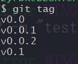

# 标签

## 什么是标签

1. 发布一个版本时，我们通常先在版本库中打一个标签（tag），这样，就唯一确定了打标签时刻的版本。将来无论什么时候，取某个标签的版本，就是把那个打标签的时刻的历史版本取出来。所以，**标签也是版本库的一个快照。**
2. 利用`git log` 查看commit的id来进行回滚到某个版本确实也是可以的，但是如果你提交七八次才发布一个版本，那么你需要找到对应的七八个id，看的你眼花缭乱。所以此种方式不可取。

## 创建标签

### 为当前分支最近一次提交添加标签

```bash
git tag tagName # 进行打标签（默认是打在当前分支的最近一次提交的版本号上）
```


### 在指定commit版本号上添加标签

```bash
git tag <tagName> 版本号(commit id)
```


### 带描述的tag

```bash
git tag -a <tagName> -m "说明" 版本号(commit id) #
```


## 查看tag标签

### 查看所有

```bash
git tag
```



### 查看指定tag的详细信息

```bash
git show <tagName>
```


## 删除标签

```bash
git tag -d <tagName>
```


## 推送到远程仓库

### 推送指定标签

- `git push origin <tagName>` 推送后从GitHub远程仓库就可以看到这个标签了

  https://github.com/idzyr/test/tags

  


### 推送所有

`git push origin --tags` 一次性推送全部尚未推送到远程的本地标签


## 删除远程仓库的标签

1. 先删除本地的`git tag -d name`

   

2. 再删除远程的git push origin :refs/tags/name

   

   

   
