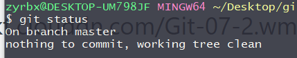
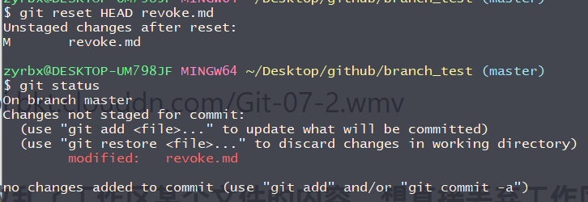

# 文件撤回到工作区

当我们把文件add到暂存区后又想撤回到工作区这时我们需要使用 

`git reset HEAD file` 

从暂存区撤回到工作区不会，覆盖工作区内容。

1. 修改文件并添加到暂存区。

2. 查看暂存区状态。

   

3. 执行从`git reset HEAD revoke.md`暂存区撤回revoke.md，再次查看暂存区会发现暂存区中不是空的了。

   