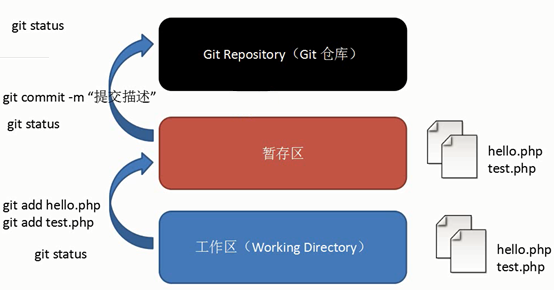
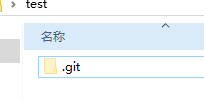
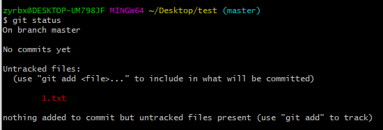
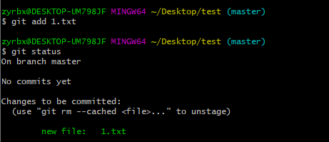
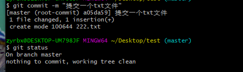

# Git使用流程

## 划分

Git分为工作区、暂存区和仓库或叫版本库

**工作区（Working Directory）；**

添加、编辑、修改文件等操作。

**暂存区；**

暂存已经修改的文件最后统一提交到git仓库中

**仓库/版本库(Git Repository)；**

最终确定的文件保存到仓库，成为一个新的版本，并且对他人可见

## 向仓库添加文件流程



1. 从工作区修改删除添加文件。
2. 将文件添加到暂存区。
3. 提交到本地git仓库。
4. 将本地仓库提交到远程仓库。

### 流程展示

**创建仓库；**

1. 本地创建一个文件存放仓库

2. `git init` 初始化git库 会在当前目录下生成一个隐藏的`.git`文件夹。

   

3. `git status`查看文件状态`touch [文件名加后缀] 新建文件`

   

4. 用 `git add [文件名] 添加到暂存区`，`git status查看提交状态。`

   

5. 提交本地git库

   ```bash
   git commit -m “描述” # 提交到本地git库
   ```

   

**删除文件；**

```
git rm 文件名
```

同样要提交信息到git库

```bash
git commit -m “描述信息”
```

​	

> [!NOTE]  
>
> 如文件添加到暂存区后文件又被编了要重新添加到暂存区
