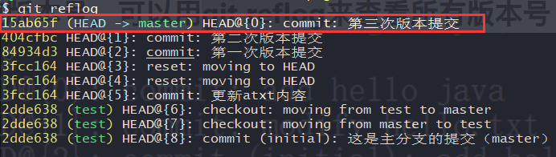
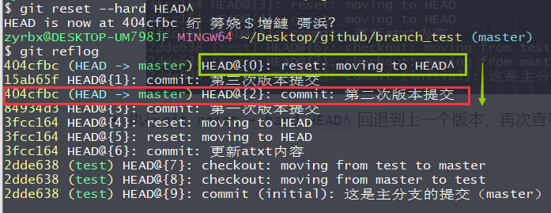
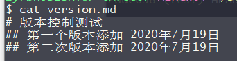
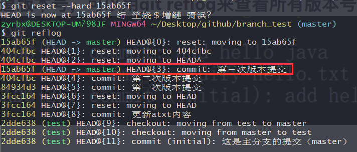
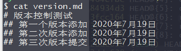

# 回退/回滚

- `git reset --hard HEAD` HEAD代表当前版本；
  - `HEAD^`代表上一版本
  - `HEAD^^`代表上上一版本
- `git reset -hard 版本号` 回退到指定版本，不用写全，写前7位即可）回退到指定版本。

## 演示

- 执行 `git reflog` 查看当前版本是master 分支下的第三次提交版本。

- 执行`git reset --hard HEAD^` 回退到上一个版本，再次查看当前版本也已经回退了。文件也还原到上一个版本了。

- 执行`git reset --hard 15ab65f` 回退到 15ab65f所代表的版本，也就是第三次版本。同样文件也还原到了第三版。

  

  

