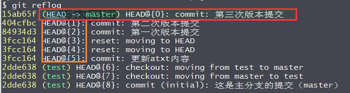

# 查看

## 查看提交日志

按下 f 键可以向下翻页，b 键可以向上翻页、 q 可以退出显示。

```bash
git log  # 从最近提交~早期提提交。
git log --pretty=oneline # 简便显示，只显示版本号，和提交描述内容。排序方式方式同上。个命令，会显示另一个分支提交日志。
```

- Author: 提交作者信息。

- HEAD : 是一个指针，表示指向那个版本，包含分支信息。，这里指向master分支下的commit 值是15ab65....这个引用的版本，也就是图中的红色字符串。

- Date：为提交日期

- 绿色部分为提交描述。

  


## 查看所有版本号

````bash
git reflog
````


- (HEAD表示当前版本是那个，这里HEAD表示master（主）分支下的 HEAD@{0}个版本。版本号从0开始，一般最近提交版本号是0早期版本依此类推。
- HEAD@{0} 左边 的黄色内容是版本编号。




